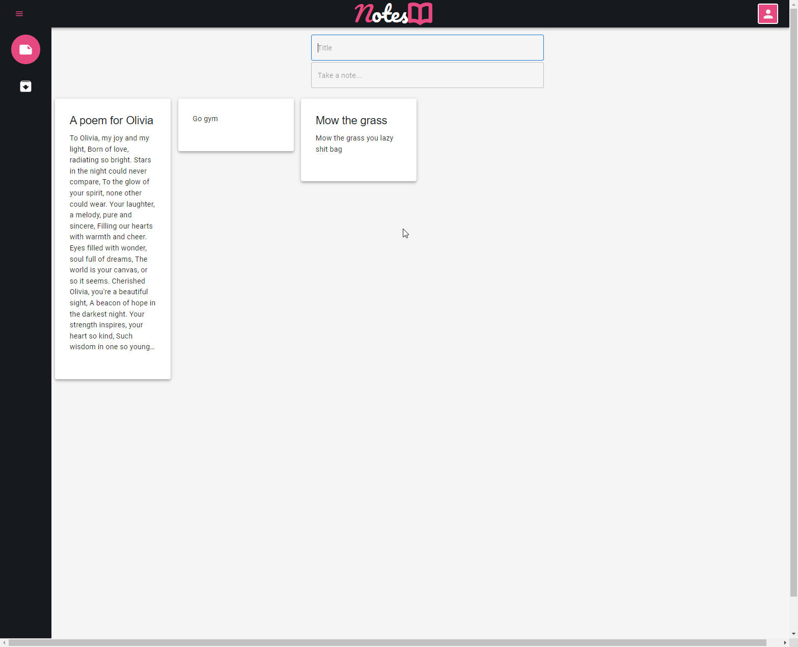

# 📒 Notes App

Welcome to Notes App, a feature-rich, easy-to-use notes manager that's sure to boost your productivity. Here's a quick guide to get you started!



## 🛠️ Prerequisites

Before you begin, make sure you meet the following requirements:

- You have a machine with Docker installed. If not, please [install Docker](https://docs.docker.com/get-docker/) first.

## 🚀 Getting Started

Setting up your environment and getting started is as simple as running a single command.

Open your terminal, navigate to the root folder of this project and run:

```sh
npm start
```
